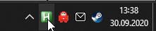

# AutoHotkey script for easy live shader editing

**This AutoHotkey script makes it easy to apply shader edits on the fly.**
This makes it less inconvenient and tedious to mess around with different blendfuncs or tweak shader values.

**When you're in your text editor (e.g. Sublime Text) and press F5, the script will automatically:**

- save the shader
- tab into the game (e.g. Q3 iDFe)
- do vid_restart

When you press F5 again, it will take you back to your text editor.

**The script:**

```
# If WinActive("ahk_exe sublime_text.exe")
f5::
send, ^s
sleep 200
MouseGetPos, xpos, ypos
WinGetTitle, Title, A
sleep 10
WinActivate, iDFe^
sleep 10
if WinActive("ahk_exe sublime_text.exe")
{
return
}
else
{
Send, {F11 down}
sleep 10
Send, {F11 up}
}
Return

# If WinActive("iDFe")
f5::
WinActivate, %Title%
MouseMove, %xpos%, %ypos%, 0
return
```

**NOTE: For this to work, you first need to do this command ingame:**
`/bind F11 vid_restart`

_(This will bind_ `vid_restart` to `F11` which the script also references. If you want it on another key for any reason, you have to bind `vid_restart` to that key ingame and also change the two instances in the script from `F11` to whatever you bound it to ingame)

**Changes you might need to make in the script:**

- If you're not using sublime text, you need to change the two instances of `sublime_text.exe` to whatever you're using. (e.g. `notepad.exe`)
  _(See troubleshooting section on bottom if unsure)_
- If you're not using iDFe, you also have to change the two instances of `iDFe` to whatever engine you're using. E.g. `Quake 3: Arena`
  _(See troubleshooting section on bottom if unsure)_
- Of course you can also edit any keybinds

**If you don't know what AutoHotkey is or how this is supposed to work, here's how to set up the whole thing in Windows:**

- Download AutoHotkey here: [CLICK TO DOWNLOAD](https://www.autohotkey.com/download/1.1/AutoHotkey112301_Install.exe "")
  (older version 1.1.23.01 to make sure this guide is accurate. newer versions might differ slightly)
- Install AutoHotkey
- The AutHotkey Icon (a green Icon with a white `H`) should show up in your Taskbar (bottom right). Right click it and press `Edit This Script`
  
- A text editor window should open. Copy the whole script from above and paste it into the text editor. (Make edits if needed)
- **Save** the text file!
- Right click the AutoHotkey Icon in the Taskbar again and press `Reload This Script`.
- Open your game (e.g. iDFe) and load a map. In the console type `/bind F11 vid_restart` and press enter. Close the console but leave your game open.
- Open your text editor (e.g. sublime text) and open up a shader file inside the editor. Do a little edit in the shader that you will recognize ingame.
- While in the text editor, press `F5`. It should now automatically save the edited shader file, tab into your game and do a vid_restart. When you press `F5` again afterwards, it should take you back to your text editor.

**Troubleshooting if things don't work:**

- Make sure you have your game opened and a map loaded.
- Make sure you do **not** have the console opened.
- Make sure that pressing `F11` ingame will do a vid_restart.
- If it only saves your shader but doesn't do the rest, increase `sleep 200` into `sleep 900` and the three instances of `sleep 10` into `sleep 90`. (then refresh script to apply the change) If it works now, decrease the values as low as they go without breaking it.
- Make sure that your engine and text editor are referenced correctly in the script. If you're not sure how to reference your editor/game, right click the AutoHotkey icon in the Taskbar and press `Window Spy`. This opens a tool which will show information about the active window.
  Activate your editor window and read the `ahk_exe` info in Window Spy.
  Activate your game window and read the `ahk_class` info in Window Spy.
  Whatever it says in these fields is what you need to replace `sublime_text.exe` and `iDFe` with respectively in the script.

**\> If you need help setting it up, feel free to contact me. (Discord: qubit.q3)**

## Attachments

- [AutoHotkey112301_Install.exe](https://trello.com/1/cards/5f741c2c30696a55bf0b1207/attachments/5f74442a5018d94cfcbd831e/download/AutoHotkey112301_Install.exe)
- [radiant_2020-09-30_13-39-07.png](https://trello.com/1/cards/5f741c2c30696a55bf0b1207/attachments/5f746e6f7956e38df508824c/download/radiant_2020-09-30_13-39-07.png)
- [ahk.png](https://trello.com/1/cards/5f741c2c30696a55bf0b1207/attachments/5f74702da732888070451eb5/download/ahk.png)
- https://trello.com/c/li1Rizac/76-sublime-text-3
- https://trello.com/c/5hnQU5dj/350-shader-syntax-highlighter-for-sublime-text-3
