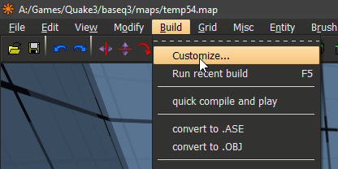
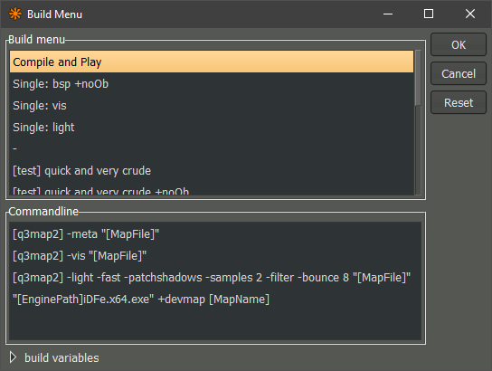

# Set up NetRadiant to automatically compile and launch the map ingame. (and write log files)

---

**This setup will allow you to gameplay test your maps straight out of** [**Garux NetRadiant**](https://trello.com/1/cards/5f744fa594821c499f4092a3/attachments/603cea864ce70f45de5b95c7/download/64-actively-developed-netradiant "") **with the single press of a button.**

---

Pressing `F5` inside NetRadiant will execute the following actions:

- Save your map
- Compile your map
- Launch the game
- Load your map

_**NOTE:**_ _Pressing_ `F5` will always execute whatever Build option was compiled last. If no map was compiled since NetRadiant was opened, it will compile with the top entry in the build menu.

---

### **There are two methods to set this up:**

- **Method 1:**
  - The map will be launched ingame after _**every**_ compile.
  - Only works with one executable (e.g. quake3.exe, idfe.64.exe,..).
  - Only works with Build Monitoring enabled.
  - Works in Windows, Mac and Linux.
  - Can't write log files.
- **Method 2:**
  - The map will be launched ingame only for selected build menu entries.
  - Works with any game/engine/mod.
    _(This method allows you to create multiple build options that launch different engines/mods, or none at all.)_
  - Only works with Build Monitoring disabled.
  - Works in Windows.
    _(Linux/Mac users can probably adjust to make it work)_
  - Allows the use of additional launch parameters/commands.
    _(e.g. start in windowed mode/fullscreen, devmap, gamemode, cpm/vq3)_
  - Enables option to write and archive log files for each map/compile.

---

# **How to set up Method 1:**

- Open the preferences (shortcut `P` or `Edit > Preferences`)
- Navigate to the Build Preferences under Settings
- Tick `Enable Build Process Monitoring` and `Run Engine After Compile` and press `OK`

By default, this will launch the base game. (e.g. quake3.exe)
If you want it to launch a different application (e.g. defrag mod):

- close Radiant
- open `netradiant-dir/gamepacks/games/q3.game` in your text editor
  _(This is_ `netradiant-dir/games/q3.game` in pre-2022 versions of NetRadiant)
  _(Instead of q3.game choose the file for your respective game, if not quake 3)_
- change the `engine_win32` (or linux/macos) entry to your preferred application.
  e.g. `engine_win32="quake3.exe"` into `engine_win32="iDFe.x64.exe"`

_you can also change the enginepath above if needed_

---

# **How to set up Method 2:**

- Open the preferences (shortcut `P` or `Edit > Preferences`)
- Navigate to the Build Preferences under Settings
- **Untick** `Enable Build Process Monitoring` and press `OK`
  
- Click `Build` and then `Customize...`
  
- Rename the **top entry** in the **Build menu** window to `Compile and Play` or to whatever you like.
  _(Whole build presets can also copy/pasted with ctrl+c/v)_
  _(You can also edit/add other entries. The top entry will be the one executed when pressing_ `F5` unless another entry was previously executed manually. So your most frequent build configuration should be the top entry.)
- While having `Compile and Play` selected, enter your BSP, VIS and LIGHT stages in the **Commandline** window. Each in its own line.
  e.g.:
  `[q3map2] -meta "[MapFile]"`
  `[q3map2] -vis "[MapFile]"`
  `[q3map2] -light -fast -patchshadows -samples 2 -filter -bounce 8 "[MapFile]"`
- In addition to BSP, VIS and LIGHT, add one more line containing the following:
  `start "" "[EnginePath]iDFe.x64.exe" +devmap [MapName]`
  (replace `[EnginePath]iDFe.x64.exe` with whatever executable you want to use.
  e.g. `C:\games\quake3\quake3.exe`)
  

  ⠀
  _- Optional: You can also add any other parameters you like_
  !
  In addition to BSP, VIS and LIGHT, add one more line containing the following:
  `start "" "[EnginePath]iDFe.x64.exe" +devmap [MapName]`
  (replace `[EnginePath]iDFe.x64.exe` with whatever executable you want to use.
  e.g. `C:\games\quake3\quake3.exe`)
  
  ⠀
  _- Optional: You can also add any other parameters you like_
  
- Click `OK`

---

# **Write and archive log files for each map/compile:**

- This optional addition only works with **Method 2**
- With this option, the q3map2 progress is written into a log file **instead** of your cmd window. There doesn't seem to be way to have both.
- Enable 'Dump non Monitored Builds Log' in Build Preferences
  
- This option only writes a temporary log in your netradiant folders. In order to archive it as _mapname.log_, add the following line above the engine launch line:
  `copy /Y /V "[RadiantPath]\settings\1.5.0\junk.txt" "[EnginePath]\logs\[MapName].log"`
  
- `IMPORTANT` This writes the log file into quake3/logs folder **only if this folder already exists** so make sure to create that folder first or adjust your path accordingly.
- Previous compile logs of the same map will be overwritten using this method. If you want to keep every compile log with a date and timestamp, change the line to: `copy /Y /V "[RadiantPath]\settings\1.5.0\junk.txt" "[EnginePath]\logs\[MapName]_%date:~-4%-%date:~3,2%-%date:~0,2%_%time:~0,2%.%time:~3,2%.%time:~6,2%.log"`

---

_side note: additional build variables can also be added in_
`netradiant-dir/settings/1.5.0/q3.game/build_menu.xml`

---

### **If you need help setting it up, feel free to contact me.**

### **(Discord: qubit.q3)**

## Attachments

- [radiant_2020-09-30_12-42-45.png](https://trello.com/1/cards/5f744fa594821c499f4092a3/attachments/5f74612cc9ea4e4c06156c2c/download/radiant_2020-09-30_12-42-45.png)
- [radiant_2020-09-30_12-44-31.png](https://trello.com/1/cards/5f744fa594821c499f4092a3/attachments/5f746199270dfc188d2f6608/download/radiant_2020-09-30_12-44-31.png)
- [radiant_2020-09-30_12-50-07.png](https://trello.com/1/cards/5f744fa594821c499f4092a3/attachments/5f7462eb4e79bc0c7e8a6b5b/download/radiant_2020-09-30_12-50-07.png)
- [radiant_2020-09-30_13-16-17.png](https://trello.com/1/cards/5f744fa594821c499f4092a3/attachments/5f7469063f09053f05710e72/download/radiant_2020-09-30_13-16-17.png)
- [radiant_2020-09-30_13-29-01.png](https://trello.com/1/cards/5f744fa594821c499f4092a3/attachments/5f746c0296c06755240dd34f/download/radiant_2020-09-30_13-29-01.png)
- [a.png](https://trello.com/1/cards/5f744fa594821c499f4092a3/attachments/5f7470aeecd97d3936eea59d/download/a.png)
- https://trello.com/c/ozD1Pj9I/64-actively-developed-netradiant
- [radiant_2021-04-20_10-10-02.png](https://trello.com/1/cards/5f744fa594821c499f4092a3/attachments/607e8ded0f3f182cabb39a3b/download/radiant_2021-04-20_10-10-02.png)
- [radiant_2021-04-20_10-12-42.png](https://trello.com/1/cards/5f744fa594821c499f4092a3/attachments/607e8def183e067d4703fc4d/download/radiant_2021-04-20_10-12-42.png)
