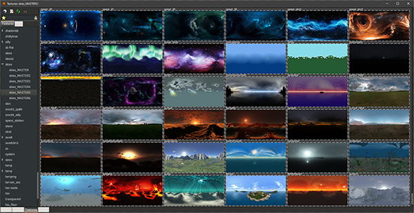

# Ultimate Skybox Pack (3700+ Skies with Shaders)

---

**Ghost** and **Garux** (FM/AM) have been working on this project for about 8 months.

They collected all the Skyboxes they could find and updated their shaders to make use of new/improved q3map2 features so make sure to use the [latest release of q3map2](https://github.com/Garux/netradiant-custom/releases) which is bundled with NetRadiant Custom. Version 20220211 or newer is required.

This pack includes skyboxes from all sorts of id Tech 3 and surce engine maps as well as newly created/adapted ones. The process included painstakingly loading up every single skybox in the game, getting the sun position and sky colors to add them to the shaders. Even going as far as fixing seams in many of the textures as well as creating a panoramic editorimage for each skybox so you can easily browse them in radiant's texture browser.

In light of this, Garux has also been working on a new NetRadiant feature where you can see the skybox inside the editor. This feature is currently available in the [development build](https://github.com/Garux/netradiant-custom/releases) and will be available in the next release after version 20220211 which is the latest version as of this post.

Truly a monumental piece of work done by these two! Enjoy!

---
##Disclaimer:

By the nature of this project, it would have been very hard, and partly impossible, to track down the original release of every single skybox. As a result of this, it's likely that some of these skyboxes are copyrighted or released with a license that requires author credit when using the skybox. Of course, none of these skyboxes should be used commercially unless you track down the original source and make sure that you have permission.

---

##Download the Skybox Pack:

###[Download from cloud.mail.ru](https://cloud.mail.ru/public/mXFg/gyz7ZiMyk)

###[Download from mega.nz](https://mega.nz/folder/UlozgZbZ#wdNuVA2BsRteOl26_NvNKg)

---

###*Readme section included in the shader file:*

DO NOT CHANGE or OVERWRITE THIS SHADER FILE!
This shader files contains a master list of skies that have been used in iD Tech 3, Space Engine & Source engines.
Duplicates & bad quality skies have been removed.
Conatins +3700 custom skies.
Shaders updated to use new q3map2 directives in favor of quality & realism.
Direction, elevation, sun value & skylight checked & fixed on ALL shaders.
Sun values match existing sun/moon/star/brightest point(s) in skybox texture.
If no 'sun' in sky texture, q3map_sunExt is removed and replaced with higher q3map_skyLight 'amount'. Use r_drawSun "0" for best visuals.
New root folder created 'skpk' to avoid conflicting textures.
Shaders broken into sub-directories: skies_MASTER, _MASTER2, _MASTER3, _MASTER4, _MASTER5 & _MASTER6 to avoid lengthy load times in radiant.
Shaders grouped as best as possible. IE: most dynamic skies can be found in _MASTER6
DO NOT CHANGE or OVERWRITE THIS SHADER FILE! Copy to your shader file, rename shader & adjust values as needed. 

Switches used for testing: -meta -v; -light -fast -v
Mappers config used for testing. Can be found on Trello.

Https://trello.com/b/zJp4pE3m/id-tech-3-mapping
Https://github.com/Garux/netradiant-custom
Https://defrag.racing/
Https://discord.q3df.run/
Http://ws.q3df.org/
Http://www.q3df.org/
Https://spaceengine.org/

Shaders compiled, checked and fixed by: Ghost & FM rev. August 15, 2022.

Skies generated in Space Egnine are NOT to be used commercially.
DO NOT CHANGE or OVERWRITE THIS SHADER FILE!

---

## Attachments

- [radiant_2022-09-01_00-26-49.png](https://trello.com/1/cards/630fe0911e6b4c012aad8753/attachments/630fe0b3ad783401820e8ff6/download/radiant_2022-09-01_00-26-49.png)
- [Mirror (cloud.mail.ru)](https://cloud.mail.ru/public/mXFg/gyz7ZiMyk)
- [Photoshop_2022-09-01_00-45-10.png](https://trello.com/1/cards/630fe0911e6b4c012aad8753/attachments/630fe48473c34001a235a57b/download/Photoshop_2022-09-01_00-45-10.png)
- [radiant_2022-09-01_01-11-40.png](https://trello.com/1/cards/630fe0911e6b4c012aad8753/attachments/630fead8cc5f3101460de399/download/radiant_2022-09-01_01-11-40.png)
- [Photoshop_2022-09-01_01-13-06.png](https://trello.com/1/cards/630fe0911e6b4c012aad8753/attachments/630feb0a5aaf5a00d7695190/download/Photoshop_2022-09-01_01-13-06.png)
- [Download](https://aciz.etjump.com/downloads/skies_MASTER/)
